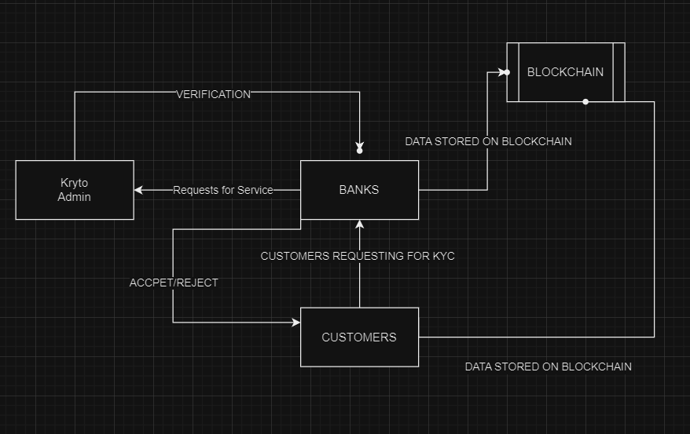

# Synergy-DJSCE
Decentralized KYC verification 
Deployed Link: [Click here to view the live app](https://synergy-byte-me-vercel.vercel.app/)  
---
**Please view this on brave browser or metamask enabled browser only.**
---
## Problem Statement
KYC (Know Your Customer) is a process of verifying the identity of the customers. It is a legal requirement for all financial institutions and other regulated entities to verify the identity of their customers before providing services. The current KYC process is centralized and is prone to data breaches and identity theft. The centralized KYC process is also time-consuming and costly. The objective of this project is to develop a decentralized KYC verification system using blockchain technology. The decentralized KYC verification system will provide a secure, cost-effective, and efficient way to verify the identity of the customers. The decentralized KYC verification system will also provide a secure way to share the customer’s identity information between different financial institutions and other regulated entities.
---
## Solution
### The following are the key features of the decentralized KYC verification system:
1. **Decentralized Identity Verification**: The decentralized KYC verification system will use blockchain technology to verify the identity of the customers. The customer’s identity information will be stored on the blockchain and will be verified by the network of nodes.
2. **Secure Identity Information**: The customer’s identity information will be stored on the blockchain in an encrypted form. The customer’s identity information will be accessible only to the authorized entities.
3. **Cost-Effective**: The decentralized KYC verification system will eliminate the need for the centralized KYC process. The decentralized KYC verification system will reduce the cost of verifying the identity of the customers.
4. **Efficient**: The decentralized KYC verification system will provide an efficient way to verify the identity of the customers. The decentralized KYC verification system will reduce the time required to verify the identity of the customers.
5. **Secure Sharing of Identity Information**: The decentralized KYC verification system will provide a secure way to share the customer’s identity information between different financial institutions and other regulated entities.
---
## Technologies
1. **Blockchain**: The decentralized KYC verification system will use blockchain technology to store and verify the customer’s identity information.
2. **Smart Contracts**: The decentralized KYC verification system will use smart contracts to automate the KYC verification process.
3. **Encryption**: The decentralized KYC verification system will use encryption to store the customer’s identity information in an encrypted form.
4. **Decentralized Storage**: The decentralized KYC verification system will use decentralized storage to store the customer’s identity information.
5. **APIs**: The decentralized KYC verification system will use APIs to share the customer’s identity information between different financial institutions and other regulated entities.
---
## TechStack
1. **Frontend**: ReactJS
2. **Smart Contracts**: Solidity, Ethereum, Alchemy, Hardhat, Sepolia testnet
---
## How to run the project
1. **Clone the repository**
2. **cd into client folder and run the following commands**
3. **`npm install`**
4. **`npm start`**
---
## FLOW

---
## Future Scope
1. **Integration with Financial Institutions**: The decentralized KYC verification system can be integrated with different financial institutions and other regulated entities to provide a secure way to share the customer’s identity information.
2. **Integration with Government Agencies**: The decentralized KYC verification system can be integrated with government agencies to provide a secure way to verify the identity of the customers.
3. **Integration with Identity Verification Services**: The decentralized KYC verification system can be integrated with identity verification services to provide a secure way to verify the identity of the customers.
4. **Integration with Decentralized Storage**: The decentralized KYC verification system can be integrated with decentralized storage to provide a secure way to store the customer’s identity information.
---
## Team Members
1. **Shubham Vishwakarma (Leader)**
2. **Anish Gade**
3. **Bodhisatya Ghosh**

